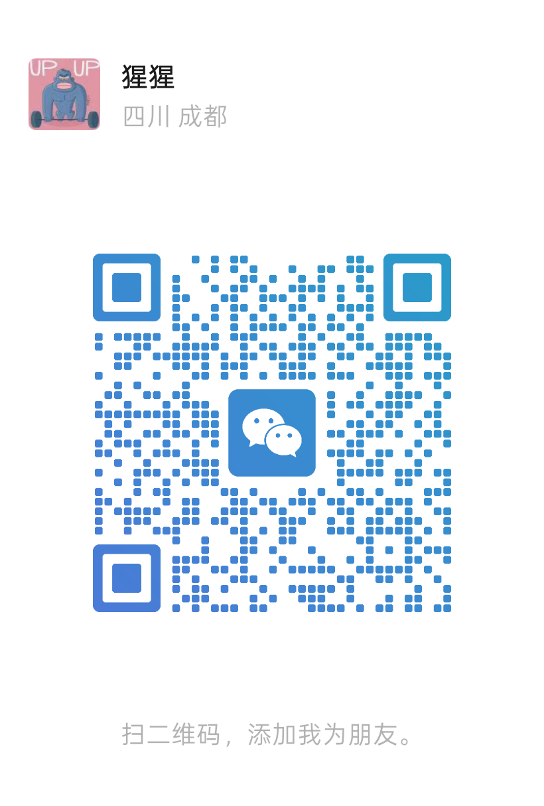

# FDE 学习先锋小队

> AI 交付工程师（FDE）成长计划 · 开源课程 + 社群化实战陪跑
> 从「听懂课」到「能交付、能验收、能落地政企环境」。

---

## 一、这是什么

一套面向 **AI 交付工程师（FDE）** 的实战成长体系，覆盖 Day00–Day18 共 19 课，
主题从需求拆解、方案选型、首调 API，一路打到政企网络拓扑、白名单、离线部署、
合规红线、专属验收标准。

本仓库**完全开源**，你可直接自学；想拿证书、要陪跑、需私人订制，往下看三层漏斗。

---

## 二、三层漏斗

```
L0  免费开源层（本仓库 + GitHub Pages）
    └─ 19 课 HTML + 18 封面 + day12 实战模拟器 + 端到端 RAG Demo

L1  9.9 学习群（微信支付入群）
    └─ 99 题测验 → 通过发「结营基础证书」（带编号，GitHub 在线可查）

L2  49.9 私人订制（1:1）
    └─ 基于 Day00 七维雷达，深度定制：学习路线 + 测试 + 实战
```

---

## 三、课程地图

| 阶段 | 课程 | 主题 |
|------|------|------|
| 认知 | Day00 | FDE 全景与七维能力雷达（35 题自评） |
| 基本功 | Day01–04 | 需求拆解 · 方案选型 · Token 估算 · 首调 API |
| 原型力 | Day05–09 | 结构化输出 · Function Calling · 文档预处理 · 向量检索 · 端到端 RAG |
| 交付力 | Day10–11 | Bad Case 与日志 · Git 与 Code Review |
| 政企落地 | Day12–16 | 网络拓扑 · 白名单 · 私有云 vs 公有云 · 离线部署 · 合规红线 |
| 收口 | Day17–18 | 专属验收标准 · 结营（雷达重测 + 成长路径） |

> 配套资产：`labs/day12_lab/`（政企拓扑连通性模拟器 + 练习册）· `rag_demo/`（端到端 RAG 工程）

---

## 四、怎么拿证书

### 结营基础证书 `FDE-B-YYYY-NNNNN`
1. 打开 `quiz/index.html`，完成 **99 题知识测验**（≥ 80 分通过）。
2. 截图成绩卡，发到 **9.9 学习群**。
3. 群主核对指纹与用时 → 签发带编号证书 → 在验证页可查。

### 结营中级证书 `FDE-I-YYYY-NNNNN`
1. 通过 99 题测验；
2. 完成 **结营测验项目（Capstone）**：详见 `capstone/README.md`；
3. 提交后群主按 Rubric 评分（环境适配单项须达标）→ 签发中级证书。

### 在线核验
👉 `certs/verify.html` —— 输入证书编号，即时验真（数据来自本仓库公开注册表）。

---

## 五、加入我们

### 9.9 学习群（可选，非必选）
微信支付 **9.9 元**入群，获得：测验答疑、证书发放、群内打卡陪跑。
入群方式：扫码加下方微信好友，备注「FDE 学习群」并付款即可。

### 49.9 私人订制路线（可选）
基于 Day00 七维雷达测评，1:1 深度定制：
- 个性化学习路径（弱维加深、强维快进，超出开源范围）
- 定制测验（针对弱维额外出题）
- 定制实战（专属 lab / capstone 变体）
- 专属复盘与路线迭代

> 扫码加微信，备注「FDE 私人订制」即可开启雷达测评。

### 个人微信（扫码加好友 · 付款 / 入群 / 订制）

<!-- ↑ 将你的个人微信二维码命名为 wechat-qr.png 放入 assets/ 目录后，图即显示 -->

---

## 六、目录结构

```
xx-fde-learning/
├── README.md              # 本文件
├── lessons/               # Day00–Day18 课程 HTML（19 课）
├── covers/                # 课程封面（18 张）
├── labs/day12_lab/        # 政企拓扑模拟器 + 实战练习册
├── rag_demo/              # 端到端 RAG 工程（Day09 配套）
├── quiz/                  # 99 题测验（index.html / questions.js / result.html）
├── capstone/              # 中级证书测验项目任务书 + 评分
├── certs/                 # 证书系统（template / generator / verify / 公开注册表）
└── assets/                # 个人微信二维码等素材
```

---

## 七、本地运行

```bash
# 测验（纯前端，任意静态服务器或直接打开 quiz/index.html）
python -m http.server 8000
# 浏览器访问 http://localhost:8000/quiz/index.html

# day12 拓扑模拟器
cd labs/day12_lab && python topo_sim.py

# 端到端 RAG Demo（需自备 API Key，详见 rag_demo/README.md）
cd rag_demo && python build_index.py && streamlit run app.py

# 签发证书（群主本地执行，见 certs/generator.py）
python certs/generator.py --name "张三" --tier basic --score 88
```

---

## 八、合规与脱敏

- 本仓库课程内容中的单位/公司均以「某单位 / 某公司」代称，公开品牌（如 ModelScope、Qwen）按惯例保留。
- 真实密钥（`.env`）**绝不入库**，仅提交 `.env.template`。
- 证书完整注册表（含姓名）仅群主本地维护，公开仓库仅含脱敏后的公开注册表。
- 本项目为学习演练，正式招投标 / 生产环境须人工复核并遵守对应合规要求。

---

## 九、证书性质与免责声明（请务必阅读）

本仓库签发的两类证书（结营基础证书 / 结营中级证书）**仅属于学习社群内部的自我激励凭证，不具备任何法律效力、职业资格效力或第三方认证效力**。

具体说明如下：

1. **性质定位**：证书是学员通过 99 题知识测验（及可选 Capstone 项目）后，社群给予的**自我成长纪念与小小奖励**，用于学习打卡、见证自己的进步，不代表任何官方资质。
2. **非职业资格**：本证书**不能**作为上岗、执业、求职背书的依据，也**不等同于**任何厂商认证（如云厂商、ModelScope 等）或国家职业资格证书。
3. **非官方背书**："FDE自助发展委员会"为社群自发学习组织，**不代表任何企业、机构或政府部门的官方认证行为**。
4. **使用边界**：请勿将证书用于虚假宣传、夸大资质、误导第三方等场景；由此产生的任何后果由使用者自行承担。
5. **能力佐证局限**：测验成绩仅反映对开源课程内容的知识掌握度，不等同于真实工程交付能力，真实项目请以实际产出与人工复核为准。

> 一句话总结：**这是你给自己努力的一份小奖励，不是职业执照，更不是官方文凭。** 学有所成、能打能交付，才是真正的含金量。

---

📜 **FDE 学习先锋小队** · 让每一次学习都变成能交付的能力。
