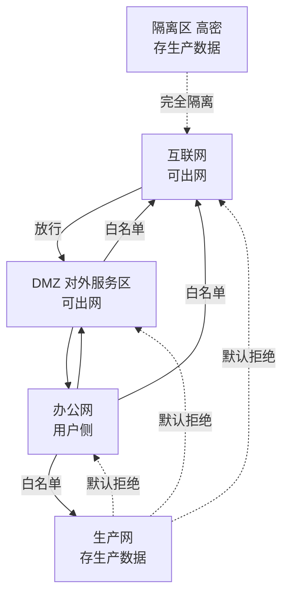

# Day12 实战练习册：把"看懂拓扑"变成"能做部署决策"

> 配套工具：`day12_lab/topo_sim.py`（政企网络拓扑连通性 + 出域检测模拟器）
> 案例系统：复用我们做过的 `rag_demo`（招标文件 RAG 问答）
> 视角：AI 交付工程师（FDE）——不是"看懂图"，而是"能在进场前判断 AI 该放哪、链路通不通、数据会不会出域"
> 红线：全文统一"某单位 / 某公司"，不对应任何真实机构

---

## 0. 先跑一遍模拟器（5 分钟上手）

```bash
cd fde_v2/day12_lab
python topo_sim.py            # 跑默认场景的 good / bad 两套方案
python topo_sim.py --placement good   # 只看合规方案
```

跑完你会看到：
- **good 方案**：RAG 全链路收口在生产网，LLM 私有化部署，只有"界面→检索"一跳需白名单，**结论：合规**。
- **bad 方案**：检索服务在生产网却直连互联网 LLM，被标红 **「不可达 + 出域红线」**，**结论：不合规**。

这一对比，就是 Day12 最该刻进肌肉记忆的判断。

---

## 1. 拓扑速览（某单位 5 层）



记住政企铁律：**默认拒绝一切，只有显式放行的才通；生产网严禁直连互联网。**

---

## 2. 五道递进习题

> 建议先自己写答案，再翻到第三节对参考答案。每题都标了"考察点"。

### 练习 1：标注五层（基础）
给你一张某单位的网络划分图，请标出它属于哪一层（互联网 / DMZ / 办公网 / 生产网 / 隔离区），并说明该层"能不能出网、能不能存生产数据"：
- (a) 对外的官网 Web 服务器区
- (b) 招标业务数据库所在区
- (c) 你日常办公用的电脑所在区
- (d) 全员都能访问的公共互联网
- (e) 涉密图纸存储区

**考察点**：能不能快速把"看到的区域"对号入座到 5 层模型。

---

### 练习 2：给 rag_demo 选位置（核心）
把 `rag_demo` 的 5 个组件，分别放到你认为合适的网络层，并写一句话理由：
- Streamlit 界面（给人用的入口）
- 检索服务（拼召回 + 调 LLM）
- FAISS 索引（由招标文件切片建成）
- 招标文件库（原始标书数据）
- LLM（生成答案的模型）

**考察点**：是否本能地让"含生产数据的组件"收口在生产网内。

---

### 练习 3：画调用链路并找雷（核心）
沿用练习 2 的摆放，假设 LLM 用的是**公网 API（如 ModelScope）**，画出一次完整问答的调用链路，并标出：
- 哪几跳"需白名单"？
- 哪一跳会"不可达"或"出域"？

**考察点**：能否在动手前就看出"生产网直连公网 LLM"这个致命坑。

---

### 练习 4：进机房前 5 问（实战习惯）
Day12 强调 FDE 进场前要先摸清地形。请列出你见到客户网络负责人时，最该问的 5 个问题（提示：围绕"我的 AI 服务放哪、数据在哪、出网怎么走、白名单找谁批"）。

**考察点**：把"拓扑意识"固化成可复用的提问清单。

---

### 练习 5：出域自检（红线）
某同事说："我把标书库放生产网，检索服务也放生产网，只是让检索服务把'检索到的文本片段'发给公网 LLM 润色一下，应该没问题吧？"
请判断这句话对不对，并用一句话给出你的处置建议。

**考察点**：是否意识到"检索到的文本片段"本身已是生产数据，出生产网即出域。

---

## 3. 参考答案

### 练习 1
| 区域 | 层 | 能出网？ | 能存生产数据？ |
|------|----|--------|--------------|
| (a) 对外官网 Web | DMZ | 能（经白名单） | 不能 |
| (b) 招标业务库 | 生产网 | 不能 | 能 |
| (c) 办公电脑 | 办公网 | 经代理白名单 | 不能 |
| (d) 公共互联网 | 互联网 | 能 | 不能 |
| (e) 涉密图纸区 | 隔离区 | 不能 | 能（高密） |

---

### 练习 2（推荐摆放 + 理由）
| 组件 | 放哪层 | 理由 |
|------|--------|------|
| Streamlit 界面 | 办公网 | 给人用，放用户侧；跨到生产网需白名单 |
| 检索服务 | 生产网 | 它要读索引和标书库，就近放生产网减少跨界 |
| FAISS 索引 | 生产网 | 由标书切片建成，含生产数据，必须收口 |
| 招标文件库 | 生产网 | 原始生产数据，必须收口 |
| LLM | 生产网（私有化） | **关键**：用私有化部署，让全链路不触网 |

> 若 LLM 用公网 API，则放互联网侧，但那样生产数据就不能出生产网去调它（见练习 3）。

模拟器 `good` 方案正是这套摆放，跑出来结论：**合规，零出域**。

---

### 练习 3
链路（公网 LLM 版）：
```
Streamlit 界面(办公网)
  → 检索服务(生产网)        [需白名单]
  → FAISS 索引(生产网)      [通]
  → 检索服务(生产网)        [通]
  → ModelScope LLM(互联网)  [不可达 + 出域红线]
```
- 需白名单的跳：界面 → 检索服务（办公网→生产网）。
- 致命跳：检索服务（生产网）→ 公网 LLM（互联网）。生产网默认拒绝直连互联网，且检索出的文本片段是生产数据，一旦发出即**出域**。

这正是模拟器 `bad` 方案的输出结果。结论：**这种摆法上线即违规**。

正确的两条出路（也是 Day13 / Day14 的伏笔）：
1. **走白名单出口代理**：生产网经申请的白名单代理出网（仍要评估出域合规）；
2. **私有化部署 LLM**：把模型部署在生产网/隔离区，数据全程不出网（模拟器 `good` 方案）。

---

### 练习 4：进机房前 5 问（FDE 版）
1. **我的 AI 服务要落哪个网段？** —— 决定部署位置与跨界数量。
2. **训练和推理数据存在哪一层？含不含生产/涉密数据？** —— 决定能否出网。
3. **调用外部 LLM / 云 API 的话，出口在哪、白名单找谁批？** —— 决定公网调用可行性。
4. **生产网到办公网 / DMZ 的放行策略是什么？谁有权开白名单？** —— 决定运维与访问路径。
5. **有没有等保 / 合规红线，禁止某些数据出域？** —— 决定整体架构是否合法。

---

### 练习 5
**这句话不对。** "检索到的文本片段"来自招标文件库，本身属于生产数据；把它发给公网 LLM，等同于生产数据出生产网，触发**出域红线**。
**处置建议**：要么把 LLM 私有化部署在生产网内（数据不出网），要么在出网前对文本做脱敏/脱密并经合规审批——绝不能"润色一下"就直接外发。

---

## 4. 延伸：把这套实战沉淀成你的 FDE 基本功

1. **拓扑意识**：见到任何政企环境，先问"五层在哪、我的东西落哪层"。
2. **位置决定架构**：AI 放生产网内 → 可私有化 LLM、数据不出网；放办公网 → 只能调公网 API 且数据要过白名单。
3. **进场敏感度**：进机房前先摸清地形再动手，比"等开发联调时才发现不通"省十天。

> 想继续深化？`day12_lab/场景_某单位5层拓扑.json` 可以改成你自己的真实（脱敏后）拓扑，再跑 `python topo_sim.py --scenario 你的.json`，把模拟器当成"部署前自检"工具用起来。这也正好衔接 Day13（白名单与防火墙申请流程）。
