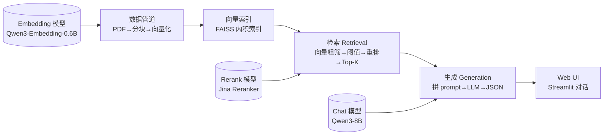

# 招标文件问答助手 · 技术设计文档

> 版本：v1.0　|　适用对象：技术评审、接手人、客户架构师　|　配套工程：`rag_demo/`

---

## 1. 文档目的

说明本 RAG Demo 的**设计思路、总体架构、模块边界与关键选型理由**，让没有参与开发的人也能快速理解"为什么这么搭、每个环节负责什么、出问题该看哪里"。本文与 `README.md`（面向"怎么跑起来"）互补：README 讲操作，本文讲设计。

---

## 2. 背景与目标

### 2.1 痛点
招标文件通常几十页，关键条款（预算、资质、截止时间、评分权重、付款方式）分散在公告、评标办法、合同条款各处。人工翻阅查找**费时、易漏、易错**，且多人协作时口径难统一。

### 2.2 目标
输入一句自然语言问题（如"ZB2026-001 的预算是多少？"），**秒级**返回：
- **答案**：基于招标文本的事实性回答；
- **引用**：答案出处（文件名 + 页码），可溯源；
- **置信度**：high / medium / low，辅助判断。

### 2.3 定位（务必看清）
本工具是**人工决策的辅助手段，不是替代**。正式招投标场景，AI 输出**仅供参考，须经人工复核**（详见《安全与脱敏说明》）。

---

## 3. 总体架构：RAG 五段链路

**核心思想（RAG = Retrieval-Augmented Generation）**：
不让大模型"凭记忆"答题，而是先**从知识库里找出相关原文**，再把原文喂给大模型**基于材料作答**。这样既能回答私有/最新文档里的问题，又能通过"引用"让答案可溯源、可纠偏。

---

## 4. 模块职责边界

| 文件 | 角色 | 职责 | 是否依赖外部 API |
|------|------|------|------------------|
| `config.py` | 配置中心 | 所有可调参数（路径/模型名/检索参数）外置，业务代码零硬编码 | 否 |
| `model_client.py` | 模型适配层 | 封装 Embedding / Rerank / Chat(JSON) 三类调用，统一重试与兜底 | **是** |
| `build_index.py` | 离线建库 | PDF→分块→向量化→写 FAISS 索引（一次性，跑完即关） | 是（仅 embedding） |
| `retriever.py` | 在线检索 | 加载索引，执行"向量粗筛→阈值→重排→Top-K" | 是（仅 rerank，可降级） |
| `generator.py` | 在线生成 | 把召回段落拼进 prompt，调 Chat 模型产出 JSON 答案 | 是（仅 chat） |
| `app.py` | 交互层 | Streamlit UI：对话、引用展开、可调参数、跨轮记忆 | 否（调用上述模块） |

**设计原则**：
- **离线 / 在线分离**：建索引（慢、一次性）与检索生成（快、高频）解耦，索引文件与代码分离，便于更新与部署。
- **配置外置**：换模型、换分块大小、换阈值都不动业务代码，只改 `.env` / `config.py`。
- **适配层收敛**：所有外部模型差异（ModelScope / Jina / 其他）封在 `model_client.py`，上层无感知。

---

## 5. 关键选型与理由

| 决策点 | 选择 | 理由 |
|--------|------|------|
| 模型服务平台 | **魔搭 ModelScope API-Inference** | OpenAI 兼容协议，免本地部署，每天免费 2000 次调用，适合 Demo / 教学 |
| Embedding 模型 | `Qwen/Qwen3-Embedding-0.6B` | 维度 1024，中文效果好、体积小、速度快；输出已归一化，内积≈余弦相似度 |
| Rerank 模型 | **Jina Rerank**（`jina-reranker-v2-base-multilingual`） | 实测 ModelScope 网关**无 `/rerank` 路由**（404），Jina 免费额度、多语言、OpenAI 兼容，作精排补位 |
| 生成模型 | `Qwen/Qwen3-8B` | 指令遵循强，支持强制 JSON 输出 |
| 向量库 | **FAISS**（本地） | 轻量、零外部依赖、索引文件可直接随包分发 |
| 分块策略 | 按"。"切分 + 滑动重叠 80 字 | 避免把"投标人资格要求"这类条款从中间切断，重叠缓解边界信息丢失 |
| 输出格式 | 强制 JSON（答案/引用/置信度） | 结构化，前端好展示、好做引用跳转、好统计 |
| UI 框架 | **Streamlit** | 纯 Python 写界面，几行代码出可交互页面，适合快速演示 |

---

## 6. 参数设计依据（config.py / .env）

| 参数 | 默认 | 取值依据 |
|------|------|----------|
| `CHUNK_SIZE` | 500 字 | 招标条款单条多在 100–400 字，500 字容纳一条完整条款且不过长导致噪声 |
| `CHUNK_OVERLAP` | 80 字 | 约 16% 重叠，平衡"不断裂"与"不冗余" |
| `COARSE_K` | 20 | 粗筛召回 20 个候选，给重排留出充分挑选空间 |
| `TOP_K` | 5 | 精排后取 5 段喂给大模型：足够上下文，又不撑爆 prompt、不引入无关噪声 |
| `SIM_THRESHOLD` | 0.4 | 余弦相似度低于此值视为"未命中"，触发"文档中未提及"而非硬编 |

> 上述值为教学/仿真数据下调优所得，真实海量标书需按召回率实测再调。

---

## 7. 可移植性与脱敏设计

**可移植性 7 条规矩（FDE 基本功）**：Key 走环境变量 · 路径全相对 · 依赖锁版本 · 索引与代码分离 · 参数外置 · 网络失败兜底 · 启动一行命令。

**脱敏设计**：本 Demo 的 3 个标书均为**虚构仿真样本**（文末自带"本文件为测试用仿真样本，数据均为虚构"声明），统一使用"某单位"代指，不含任何真实主体、金额、时间。可直接用于公开演示与教学，无泄密风险。真实数据接入规范见《安全与脱敏说明》。

---

## 8. 已知限制

1. **重排依赖外部网络**：Jina 偶发抖动会回退"向量相似度排序"，主流程不受影响（已实测验证）。
2. **仅中文、仅已索引文档**：未上传的标书、文档外常识性问题无法回答（按设计"不瞎编"）。
3. **不保证 100% 准确**：分块边界、歧义问法、跨页条款仍可能误召回，需配合引用人工核对。
4. **无多轮语义压缩**：当前 UI 的"记忆"仅拼接历史，未做长对话摘要，超长对话可能溢出上下文。

---

## 9. 后续演进建议

- 接入**更大 Embedding / Reranker** 提升长文档召回；
- 增加**表格 / 图片 OCR** 解析，覆盖标书里的资质表、评分表；
- 增加**评估闭环**：固化 `eval_demo.py`，每次改参后自动跑回归；
- 真实场景增加**权限与审计日志**，满足合规。
